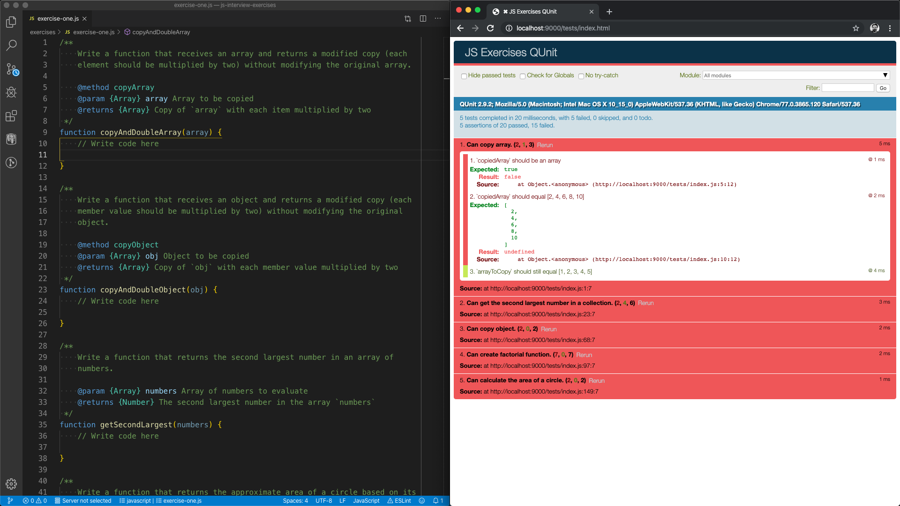

# JavaScript Interview Exercises

This project includes predefined JavaScript function definitions and accompanying tests that can be used to evaluate a JavaScript developer candidate's knowledge, thought process, research skills and problem solving techniques.

## Prerequisites

* Git (optional)
* node >= 8.11.3
* npm >= 5.6.0
* Text editor/IDE

## Install

* `git clone https://github.com/kboucher/js-interview-exercises.git`
* `cd js-interview-exercises`
* `npm install`

## Instructions

* `npm start` _(This will start a _Browsersync_ session and launch a browser with the _QUnit_ tests running.)_
* Open the project in your preferred text editor/IDE
* Open the designated _exercises_ JavaScript file and begin coding
* Feel free to use all available resources to help you solve these problems (Google, MDN, etc.)
* Do "think out loud" in order to communicate your thought process

NOTE: It can be helpful to arrange your desktop with the code editor and tests page side-by-side. As the changes to the shell functions are saved, the tests will rerun automatically.

### Example Desktop Layout

## Resources

* [Mozilla Developer Network JavaScript documentation](https://developer.mozilla.org/en-US/docs/Web/JavaScript)
* [Browsersync documentation](https://www.browsersync.io/docs)
* [Qunit documentation](https://api.qunitjs.com/)
